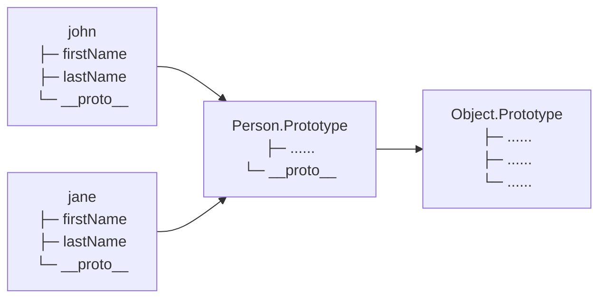

# Prototype

- JavaScript sebelumnya dikenal dengan pemrograman berbasis prototype
- Memang agak sedikit membingungkan, dan tidak dipungkiri, banyak sekali yang bingung dengan konsep prototype di JavaScript
- Pada chapter ini, kita akan bahas tentang konsep prototype

## Prototype Inheritance

- Saat kita membuat object dari constructor function, object tersebut disebut instance, semua property (baik itu value atau method), akan berada di dalam instance object nya
- Setiap kita membuat sebuah constructor function, maka secara otomatis akan dibuatkan prototype nya, misal ketika kita membuat constructor function Person, maka akan ada Person.prototype
- Saat kita membuat sebuah object instance, secara otomatis object tersebut adalah turunan dari Constructor.prototype nya
- Untuk mengakses prototype milik sebuah instance, kita bisa menggunakan __proto__

## Kode : Constructor Function Person

Pertama kita buat constructor function Person terlebih dahulu:

```javascript
function Person(firstName, lastName) {
  this.firstName = firstName;
  this.lastName = lastName;
  this.sayHello = function(name) {
    console.info(`Hello ${name}, my name is ${this.firstName}`);
  }
}
```

**Penjelasan:**
Constructor function `Person` adalah template untuk membuat object. Di dalamnya terdapat property `firstName`, `lastName`, dan method `sayHello`. Ketika kita membuat instance baru dengan keyword `new`, JavaScript akan membuat object baru dan menjalankan function ini dengan `this` yang merujuk ke object baru tersebut.

## Kode : Object Instance

Sekarang kita buat beberapa object instance dari constructor function Person:

```javascript
const john = new Person("John", "Doe");
const jane = new Person("Jane", "Smith");

console.info(john);
console.info(jane);

john.sayHello("Michael");
jane.sayHello("Sarah");
```

**Penjelasan:**
Kita membuat dua object instance `john` dan `jane` dari constructor function `Person`. Setiap instance memiliki property `firstName` dan `lastName` yang berbeda sesuai parameter yang diberikan. Kedua object ini juga memiliki method `sayHello` yang bisa dipanggil.

**Output:**
```
▼ Person {firstName: "John", lastName: "Doe", sayHello: ƒ}
    firstName: "John"
    lastName: "Doe"
  ► sayHello: ƒ (name)
  ► __proto__: Object

▼ Person {firstName: "Jane", lastName: "Smith", sayHello: ƒ}
    firstName: "Jane"
    lastName: "Smith"
  ► sayHello: ƒ (name)
  ► __proto__: Object

Hello Michael, my name is John
Hello Sarah, my name is Jane
```

## Diagram Prototype

Diagram berikut menunjukkan hubungan antara object instance dengan prototype:



**Penjelasan Diagram:**
- Object instance `john` dan `jane` memiliki property `firstName`, `lastName`, dan `__proto__`
- `__proto__` dari setiap instance menunjuk ke `Person.Prototype`
- `Person.Prototype` juga memiliki `__proto__` yang menunjuk ke `Object.Prototype`
- Ini membentuk prototype chain (rantai prototype) dalam JavaScript

## Menambah Property ke Prototype

- Property mirip object, dimana kita bisa menambah property baik itu value ataupun method
- Saat kita menambah sebuah property ke Prototype, secara otomatis, semua object instance yang turunan dari prototype tersebut akan memiliki property tersebut

## Kode : Menambah Property ke Instance Object

Berikut adalah contoh menambahkan property langsung ke instance object:

```javascript
const john = new Person("John", "Doe");
const jane = new Person("Jane", "Smith");

// ini hanya untuk instance object john
john.sayBye = function () {
  console.info("Good Bye from John");
}

// Coba panggil method sayBye
john.sayBye();  // Berhasil

// jane tidak memiliki method sayBye
// jane.sayBye();  // Error: jane.sayBye is not a function
```

**Penjelasan:**
Pada kode di atas, kita menambahkan method `sayBye` langsung ke instance object `john`. Property ini hanya akan dimiliki oleh object `john` saja, tidak akan dimiliki oleh instance object lain seperti `jane`. Jika kita mencoba memanggil `jane.sayBye()`, akan terjadi error karena `jane` tidak memiliki method tersebut.

**Output:**
```
Good Bye from John
```

## Kode : Menambahkan Property ke Prototype

Berikut adalah contoh menambahkan property ke Prototype agar bisa digunakan oleh semua instance:

```javascript
// Tambahkan method ke Person.prototype
Person.prototype.sayBye = function () {
  console.info("Good Bye");
}

Person.prototype.run = function () {
  console.info(`${this.firstName} is running`);
}

// Buat instance baru
const john = new Person("John", "Doe");
const jane = new Person("Jane", "Smith");
const michael = new Person("Michael", "Johnson");

// Semua instance bisa menggunakan method dari prototype
john.sayBye();
jane.sayBye();

john.run();
jane.run();
michael.run();
```

**Penjelasan:**
Pada kode di atas, kita menambahkan method `sayBye` dan `run` ke `Person.prototype`. Dengan cara ini, semua instance object yang dibuat dari constructor function `Person` (seperti `john`, `jane`, dan `michael`) akan memiliki akses ke kedua method tersebut melalui prototype chain. Ini lebih efisien dari segi memori karena method hanya disimpan satu kali di prototype, bukan di setiap instance.

**Output:**
```
Good Bye
Good Bye
John is running
Jane is running
Michael is running
```

## Cara Kerja Prototype Inheritance

- Bagaimana bisa property di prototype diakses dari object instance?
- Ketika kita mengakses property di object instance, pertama akan di cek apakah di object tersebut terdapat property tersebut atau tidak, jika tidak, maka akan di cek di __proto__ (prototype) nya, jika masih tidak ada, akan di cek lagi di __proto__ (prototype) yang lebih tinggi, begitu seterusnya, sampai berakhir di Object Prototype

## Kode : Demonstrasi Prototype Chain Lookup

Mari kita lihat bagaimana JavaScript mencari property melalui prototype chain:

```javascript
// Buat constructor function
function Person(firstName, lastName) {
  this.firstName = firstName;
  this.lastName = lastName;
}

// Tambahkan method ke prototype
Person.prototype.sayHello = function(name) {
  console.info(`Hello ${name}, my name is ${this.firstName}`);
}

Person.prototype.getFullName = function() {
  return `${this.firstName} ${this.lastName}`;
}

// Buat instance
const john = new Person("John", "Doe");

// Tambahkan method khusus untuk john saja
john.sayGoodbye = function() {
  console.info("Goodbye from John!");
}

// Test 1: Akses property yang ada di instance
console.info("=== Test 1: Property di Instance ===");
console.info(john.firstName);  // Cek di john -> ketemu!

// Test 2: Akses method yang ada di prototype
console.info("\n=== Test 2: Method di Prototype ===");
john.sayHello("Michael");  // Cek di john -> tidak ada, cek di Person.prototype -> ketemu!

// Test 3: Akses method yang hanya ada di john
console.info("\n=== Test 3: Method Khusus di Instance ===");
john.sayGoodbye();  // Cek di john -> ketemu!

// Test 4: Akses method dari Object.prototype
console.info("\n=== Test 4: Method dari Object.prototype ===");
console.info(john.toString());  // Cek di john -> tidak ada, cek di Person.prototype -> tidak ada, cek di Object.prototype -> ketemu!

// Test 5: Cek apakah property ada di object atau prototype
console.info("\n=== Test 5: Mengecek Lokasi Property ===");
console.info("firstName ada di john?", john.hasOwnProperty("firstName"));  // true
console.info("sayHello ada di john?", john.hasOwnProperty("sayHello"));  // false (ada di prototype)
console.info("sayGoodbye ada di john?", john.hasOwnProperty("sayGoodbye"));  // true
```

**Penjelasan Detail:**

1. **Property di Instance** - Ketika kita akses `john.firstName`, JavaScript langsung menemukan property ini di object `john` sendiri, jadi tidak perlu naik ke prototype chain.

2. **Method di Prototype** - Ketika kita panggil `john.sayHello("Michael")`, JavaScript tidak menemukan method ini di object `john`, kemudian naik ke `Person.prototype` dan menemukan method tersebut di sana.

3. **Method Khusus Instance** - Method `sayGoodbye` hanya ada di object `john`, jadi langsung ditemukan tanpa perlu cek prototype.

4. **Method dari Object.prototype** - Method `toString()` tidak ada di `john`, tidak ada di `Person.prototype`, tapi ada di `Object.prototype` (level teratas dari prototype chain).

5. **hasOwnProperty** - Method ini berguna untuk mengecek apakah property benar-benar ada di object itu sendiri atau hanya inherited dari prototype.

**Output:**
```
=== Test 1: Property di Instance ===
John

=== Test 2: Method di Prototype ===
Hello Michael, my name is John

=== Test 3: Method Khusus di Instance ===
Goodbye from John!

=== Test 4: Method dari Object.prototype ===
[object Object]

=== Test 5: Mengecek Lokasi Property ===
firstName ada di john? true
sayHello ada di john? false
sayGoodbye ada di john? true
```

## Kode : Visualisasi Prototype Chain dengan Console

Kita bisa melihat prototype chain secara langsung di console:

```javascript
function Person(firstName, lastName) {
  this.firstName = firstName;
  this.lastName = lastName;
}

Person.prototype.sayHello = function(name) {
  console.info(`Hello ${name}`);
}

const john = new Person("John", "Doe");

// Lihat prototype dari john
console.info("\n=== Prototype Chain ===");
console.info("john.__proto__ === Person.prototype:", john.__proto__ === Person.prototype);
console.info("Person.prototype.__proto__ === Object.prototype:", Person.prototype.__proto__ === Object.prototype);
console.info("Object.prototype.__proto__:", Object.prototype.__proto__);  // null (akhir dari chain)

// Lihat struktur lengkap
console.info("\n=== Struktur john ===");
console.dir(john);
```

**Penjelasan:**
Kode ini menunjukkan bagaimana prototype chain terhubung:
- `john.__proto__` menunjuk ke `Person.prototype`
- `Person.prototype.__proto__` menunjuk ke `Object.prototype`
- `Object.prototype.__proto__` adalah `null` (akhir dari prototype chain)

**Output:**
```
=== Prototype Chain ===
john.__proto__ === Person.prototype: true
Person.prototype.__proto__ === Object.prototype: true
Object.prototype.__proto__: null

=== Struktur john ===
Person
  firstName: "John"
  lastName: "Doe"
  [[Prototype]]: Object
    sayHello: ƒ (name)
    constructor: ƒ Person(firstName, lastName)
    [[Prototype]]: Object
      constructor: ƒ Object()
      hasOwnProperty: ƒ hasOwnProperty()
      toString: ƒ toString()
      ... (dan method Object.prototype lainnya)
```

## Kode : Override Property dari Prototype

Kita juga bisa "menimpa" property yang ada di prototype dengan membuat property baru di instance:

```javascript
function Person(firstName) {
  this.firstName = firstName;
}

// Method di prototype
Person.prototype.greet = function() {
  return `Hi, I'm ${this.firstName}`;
}

const john = new Person("John");
const jane = new Person("Jane");

// Test method dari prototype
console.info("=== Method dari Prototype ===");
console.info(john.greet());  // "Hi, I'm John"
console.info(jane.greet());  // "Hi, I'm Jane"

// Override method untuk john saja
john.greet = function() {
  return `Hello, my name is ${this.firstName}!`;
}

// Test setelah override
console.info("\n=== Setelah Override ===");
console.info(john.greet());  // "Hello, my name is John!" (menggunakan method di instance)
console.info(jane.greet());  // "Hi, I'm Jane" (masih menggunakan method dari prototype)

// Cek apakah method ada di object sendiri
console.info("\n=== Pengecekan ===");
console.info("john.hasOwnProperty('greet'):", john.hasOwnProperty('greet'));  // true
console.info("jane.hasOwnProperty('greet'):", jane.hasOwnProperty('greet'));  // false
```

**Penjelasan:**
Ketika kita membuat property dengan nama yang sama di instance object, property tersebut akan "menutupi" (shadow) property yang ada di prototype. JavaScript akan menemukan property di instance terlebih dahulu dan tidak akan melanjutkan pencarian ke prototype. Namun property di prototype tetap ada dan tidak berubah, hanya instance yang memiliki property tersebut yang akan menggunakan versi override.

**Output:**
```
=== Method dari Prototype ===
Hi, I'm John
Hi, I'm Jane

=== Setelah Override ===
Hello, my name is John!
Hi, I'm Jane

=== Pengecekan ===
john.hasOwnProperty('greet'): true
jane.hasOwnProperty('greet'): false
```
