# 🌐 Pengenalan DOM (Document Object Model)

## 📚 Apa itu DOM?

- **Ketika sebuah website di load oleh Browser**, maka Browser akan membuat **Document Object Model** untuk halaman website tersebut

  > 💡 **Penjelasan:** Saat Anda membuka sebuah halaman web, browser tidak langsung menampilkan teks HTML mentah. Browser terlebih dahulu membaca dan memproses HTML tersebut, kemudian mengubahnya menjadi struktur object yang dapat diakses dan dimanipulasi. Struktur inilah yang disebut DOM.

- **DOM dibuat dalam bentuk tree / pohon** yang tiap cabang nya berisikan object dari jenis elemen HTML

  > 💡 **Penjelasan:** Struktur pohon (tree) ini mirip seperti pohon keluarga atau struktur folder di komputer. Setiap elemen HTML (seperti `
`, `
`, `<h1>`) menjadi sebuah "node" atau titik dalam pohon tersebut. Elemen yang ada di dalam elemen lain menjadi "anak" (child), dan elemen pembungkusnya menjadi "induk" (parent).

- **JavaScript memiliki kemampuan untuk memanipulasi DOM**, artinya dengan JavaScript, kita bisa mengakses tiap object di DOM bahkan memanipulasi object nya

  > 💡 **Penjelasan:** Dengan JavaScript, kita dapat melakukan berbagai hal seperti mengubah teks, menambah elemen baru, menghapus elemen, mengubah style/tampilan, merespon interaksi user (klik, hover, dll), dan masih banyak lagi. Inilah yang membuat website menjadi interaktif dan dinamis!

---

## 🌳 Diagram DOM

Berikut adalah visualisasi struktur DOM dalam bentuk tree:

```mermaid
graph TD
    A[📄 Document] --> B[🏠 html]
    B --> C[📋 head]
    B --> D[📦 body]
    C --> E[📌 title]
    D --> F[🔤 h1]
    D --> G[📝 p]
    D --> H[📁 div]
    H --> I[📝 p]
    H --> J[🔗 a]
```

> 🎯 **Contoh Struktur:**
> - **Document** adalah root/akar dari seluruh DOM
> - **html** adalah elemen teratas yang membungkus semua elemen lainnya
> - **head** berisi metadata (seperti title, link ke CSS, dll)
> - **body** berisi konten yang terlihat di halaman web
> - Elemen-elemen seperti **h1**, **p**, **div**, **a** adalah elemen-elemen HTML yang membentuk konten halaman

---

## 🔗 DOM dan JavaScript

### ❓ Apakah DOM itu JavaScript?

- **DOM bukanlah fitur atau bahasa pemrograman**, DOM sebenarnya hanyalah **representasi Object dari Struktur halaman web**

  > 💡 **Penjelasan:** Banyak yang mengira DOM adalah bagian dari JavaScript, padahal tidak. DOM adalah standar yang terpisah. DOM adalah cara browser merepresentasikan halaman web dalam bentuk object yang dapat diakses oleh bahasa pemrograman.

- **DOM sendiri sebenarnya bukanlah bagian dari bahasa pemrograman JavaScript**, melainkan **bagian dari Web API**

  > 💡 **Penjelasan:** Web API adalah kumpulan interface yang disediakan oleh browser untuk berinteraksi dengan halaman web. Selain DOM, contoh Web API lainnya adalah Fetch API (untuk HTTP request), Geolocation API (untuk mendapatkan lokasi), dll. JavaScript hanya menggunakan API ini untuk berinteraksi dengan halaman web.

- **DOM sendiri di desain secara agnostik**, artinya sebenarnya bisa digunakan menggunakan bahasa pemrograman apapun, karena memang untuk membuat Web, kita tidak hanya bisa menggunakan bahasa pemrograman JavaScript

  > 💡 **Penjelasan:** Meskipun JavaScript adalah bahasa yang paling umum digunakan untuk memanipulasi DOM di browser, secara teknis bahasa lain juga bisa mengakses DOM. Misalnya, Python dapat mengakses DOM melalui library seperti Selenium untuk web scraping atau automation testing.

---

## 🎯 Kesimpulan

- ✅ **DOM** adalah representasi struktur halaman web dalam bentuk tree/pohon
- ✅ **Browser** secara otomatis membuat DOM saat halaman web di-load
- ✅ **JavaScript** dapat memanipulasi DOM untuk membuat website interaktif
- ✅ **DOM bukan bagian dari JavaScript**, melainkan Web API yang dapat diakses oleh berbagai bahasa pemrograman

---

**🚀 Happy Coding!**
